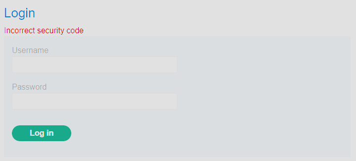

## Cách phát hiện
	1.Quan sát request/reponse:
		. sau khi login có resquest gửi mã code otp
		. Ta sẽ thấy rằng reponse nó luôn trả về 200 khi nó sai, 302 khi đúng -> brute-force khả thi
	2. Ta thử gửi nhiều nhiều lần otp sai mà nó không bị limit, block
## Cách tấn công
Lab này theo kịch bản là lộ username với password tuy nhiên phải có 2FA mới vào được acc và điều chú ý ở đây là khi ta nhập sai otp 2 lần thì nó tự động logout, thêm nữa việc lập đi lặp lại nó không bị block acc -> ta dùng brute-force Như ở trên ta có thể thao tác đi thao tác lại để có thể lấy lại được 2FA ta có thể dùng marcro.
`setting` -> `session` -> `add` 
vào `scope` chọn `include all URls` 
trong `detail` -> add -> `run a macro` 
Ta sẽ bắt 3 gói tin theo thứ tự:
1. Gói `GET` đầu nhận thông tin vào trang login nó cũng khởi tạo lại crsf 
2. Gói `POST` điền thông in user vào
3. Gói `GET` cuối là để truy cập vào tragn 2FA

Cuối cùng ta cho nó chạy từng request là 1:
Còn payload vì nó có tối đa là 4 số thì ta cấu hình như sau:
  
Sau khi ta thực hiện xong các bước trên giờ ta ấn `Start attack` đợi khi brute-force được otp khi thành công ta sẽ thu được status là `302` trong gói tin reponse đó có phiên session ta sẽ dùng nó để đăng nhập vào tài khoản

## Phòng tránh 
1. Mã 2FA đủ mạnh như dùng 6 - 8 chữ số
2. Rate-limit: nếu nhập sai nhiều lần thì sẽ khóa tài khoản đó tạm thời và thêm captcha sau khi nhập 1 2 lần sai mã
3. Cảnh báo: nếu như 1 tài khoản nào có hàng trăm hàng nghìn request 2FA thì sẽ phải gửi cảnh báo đến hệ thống