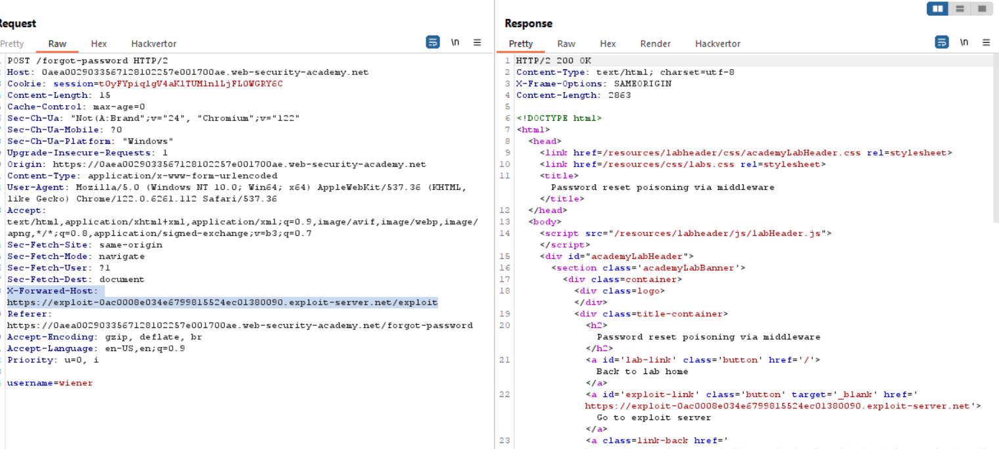

## Cách nhận biết
1. Phân tích chức năng reset password
	- Yêu cầu reset mật khẩu cho user
	- Mở mail xem thông tin link được gửi
	- Quan sát xem link trong mail xem domain có phải là domain gốc của web đấy hay không
2. Thử can thiệp Host  header
	- Gửi request reset password và bắt gói tin đấy
	- Thêm hoặc thay đổi `X-Forwarded-Host: link exploit của mình` 
	- Gửi đi và kiêm tra trong xem link đó có chuyển sang exploit cuat mình không
## Cách khai thác
Trong lab này ta sẽ dựa vào `forgot-password` để khai thác

Khi ta thực hiện reset mật khẩu thì ta thấy rằng có 1 token ở phía back-end gửi về xem ai là người yêu cầu. Do đó ta sẽ phải làm sao để có thể lấy được token này/\
Ở đây ta sẽ dùng `X-Forwarded-Host` mục đính dùng cái này là gửi response về server khai thác của mình
> X-Forwarded-Host là một HTTP header được sử dụng để chỉ định host ban đầu của một request khi nó đi qua một proxy ngược (reverse proxy) hoặc load balancer. Header này giúp các ứng dụng web hiểu được tên miền gốc mà client thực sự sử dụng để truy cập vào trang web.

> Cách hoạt động của X-Forwarded-Host

- Khi 1 request HTTP đi qua 1 proxy/ngnx load balancer, host ban đầu có thể bị thay đổi hoặc bị ẩn.
- Proxy/nginx sẽ thêm  header X-Forwarded-Host để bảo toàn thông tin về host gốc.
- Server backend có thể đọc header này để xác định tên miền thực tế mà client đã truy cập

Thay username = carlos

Quay về exploit server để bắt được gói tin như bên dưới và lấy được token reset

Ta sẽ lấy token đấy để gửi
Còn lại ta chỉ còn đăng nhập bằng tài khoản victim đã đổi mật khẩu