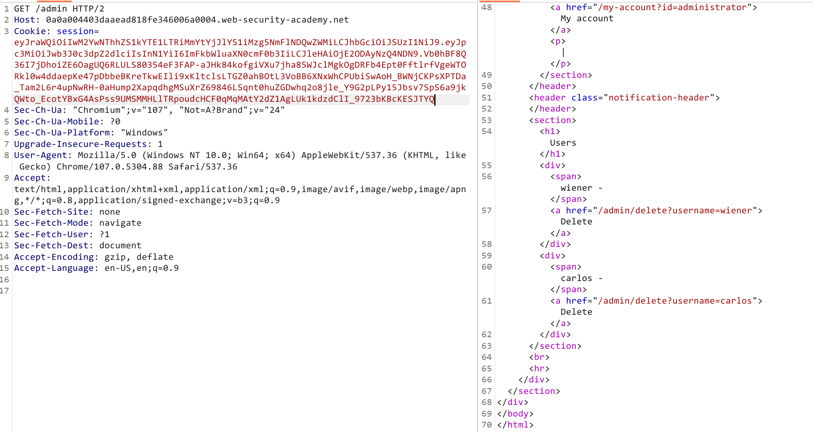

Ta sẽ login và thông tin account được cung cấp, ta thấy được web trả về jwt

Ta tìm giá trị trong jwt và thu được giá trị của trường `sub` sẽ thay đổi nó thành `administrator` rồi ấn apply
Cuối cùng chỉ cần xóa user calos là hoàn thành lab
