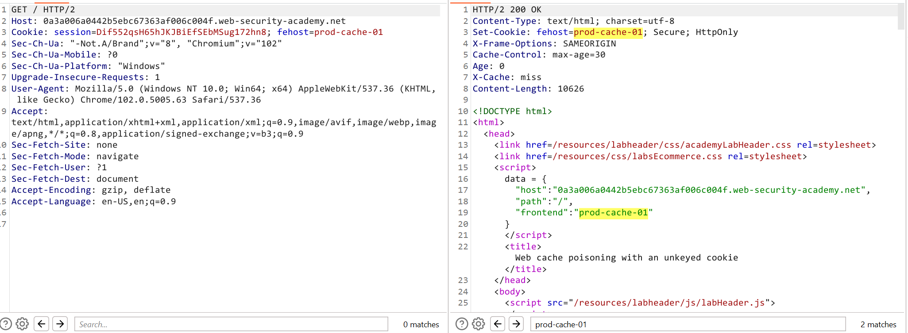
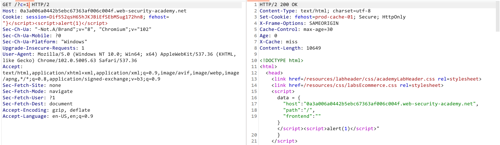
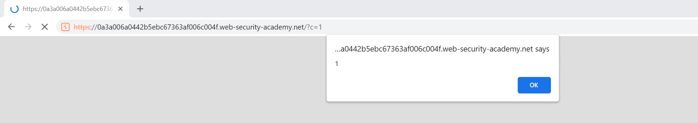

## Phân tích và exploit
Khi ta gửi request thì ta sẽ thấy được cookie `fehost` được refect trong fiel `frontend` trong biến `data` 
Ta sẽ thử break lại và chèn xss

Ta sẽ thu được kết quả
Đồng thời nó cũng hoàn thành lab